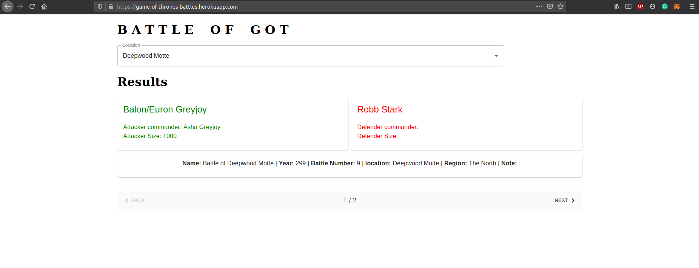

# got-battles-app

### End points  
1. /list - returns list(array) of all the places where the battle has taken place  
2. /count - returns the total number of battles occurred  
3. /search?king=Robb Stark - return list of battles where 'attacker_king' or 'defender_king' was 'Robb Stark'  
4. /search?king=Robb Stark&location=Riverrun&battle_type=siege - returns a list of battles where king is robb stark, location is riverrun and type is siege  

## UI of the app

